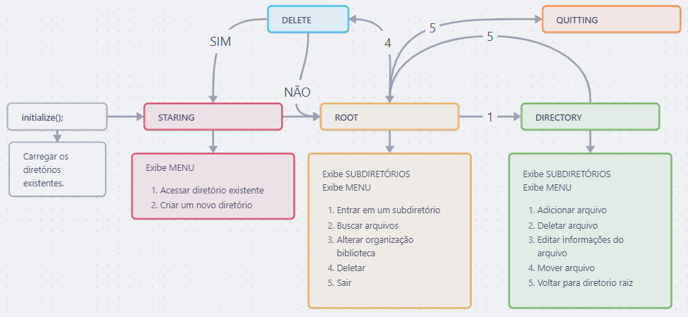

# Gerenciador de arquivos 

## 📖 Descrição
Este projeto é uma aplicação em Java que gerencia arquivos PDF por meio de uma interface de linha de comando. Ele permite que o usuário crie, edite, busque e exclua entradas de três tipos principais: **Livro**, **Nota de Aula** e **Slide**. Cada entrada contém metadados informados pelo usuário, e os arquivos PDF são organizados em uma estrutura de diretórios por autor.

A aplicação segue o paradigma da programação orientada a objetos e é construída com uma [**arquitetura Game Loop**](https://gameprogrammingpatterns.com/game-loop.html), permitindo que o usuário interaja continuamente com o sistema até escolher sair. Os dados da biblioteca ativa são persistidos em um arquivo `.txt` na pasta `data/`.

### Funcionalidades
- Criação de entradas (livro, nota de aula, slide)
- Organização por autor e tipo
- Persistência via arquivo de texto
- Estrutura de diretórios configurável
- Game Loop interativo
- Suporte à alternância entre bibliotecas
- Menu em terminal com navegação simples

## ✅ Implementação
### Digaram de Estados

### To-Do
- [x] Base do projeto - JÚLIA
- [x] Leitura do path das bibliotecas raiz existentes no metodo `void initialize()` da classe `GameLoop` - THIAGO
- [ ] STARTING
    - [ ] Exibir opçõe do MENU - JÚLIA
    - [ ] Validar as entradas do _path_ - JÚLIA
    - [ ] Instânciar um novo objeto `Library` e seus arquivos. - HEITOR
    - [ ] Alterar o estado e validar fluxo do loop - JÚLIA
- [ ] ROOT
    - [ ] Exibir opçõe do MENU - JÚLIA
    - [ ] Validar as entradas do _path_ - JÚLIA
    - [ ] Operações da biblioteca (classe `Library`) - HEITOR
    - [ ] Alterar o estado e validar fluxo do loop - JÚLIA
 - [ ] DIRECTORY
    - [ ] Exibir opçõe do MENU - JÚLIA
    - [ ] Validar as entradas do _path_ - JÚLIA
    - [ ] Operações dos arquivos (classe `File`)  - MARCOS
    - [ ] Alterar o estado e validar fluxo do loop - JÚLIA
- [ ] DELETE - JÚLIA
- [ ] QUITTING - JÚLIA

## 📁 Estrutura de Pastas - DESATUALIZADO
```
Gerenciador_Arquivos/
├── src/                # Código-fonte em Java
│   ├── app/            # Ponto de entrada e loop principal
│   ├── core/           # Lógica de negócio (biblioteca, entradas, persistência)
│   ├── menu/           # Menu textual interativo
│   └── utils/          # Funções auxiliares (como cópia de arquivos)
├── data/               # Arquivo config.txt com caminho da biblioteca ativa
├── build/              # Arquivos compilados .class
├── README.md           # Este arquivo
├── run.sh              # Script para compilar e rodar
└── .gitignore          # Arquivos a serem ignorados no Git
```

## ⚙️ Como Compilar e Executar -DESATUALIZADO

### Pré-requisitos
- Java 11 ou superior instalado
- Terminal com acesso a comandos `javac` e `java`

### 1. Compilar
```bash
javac -cp "libs/gson-2.9.1.jar" -d build src/app/Main.java src/core/*.java src/utils/*.java
```

### 2. Executar
```bash
java -cp "libs/gson-2.9.1.jar;build" app.Main
```

### 3. Alternativamente, use o script no git bash:
```bash
./run.sh
```

## 👥 Autores
- Heitor Oswaldo
- Júlia Guilhermino
- Marcos Fontes
- Thiago Raquel

---
> Projeto acadêmico desenvolvido como parte da disciplina DIM0116 - Linguagem de Programação II (2025.1)
